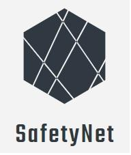

 * * *  

<h1 align="center">
 OpenClassrooms Java Application Developer Project 5
</h1>

 

  

<h2 align="center">
 OpenClassrooms Java Application Developer Project 5
</h2>

SafetyNetAlerts is an API, reading a specific json files to process informations using Endpoints. This API respects SOLID princips and REST architecture.

 

<h2>Project info : </h2>
<h5>Récapitulatif stack technique : </h5>
https://s3-eu-west-1.amazonaws.com/course.oc-static.com/projects/DAJava_P5/Spe%CC%81cifications+et+stack+technique+des+SafetyNet+Alerts.pdf
<h5>Endpoints : </h5>
https://s3-eu-west-1.amazonaws.com/course.oc-static.com/projects/DAJava_P5/Endpoints.pdf
<h5>Urls : </h5>
https://s3-eu-west-1.amazonaws.com/course.oc-static.com/projects/DAJava_P5/URLs.pdf

<h2>Launch app</h2>
<ol>
<li>Clone project</li>
<li>Open it in your favorite IDE</li>
<li>Launch "SafetynetApplication"</li>
</ol>
